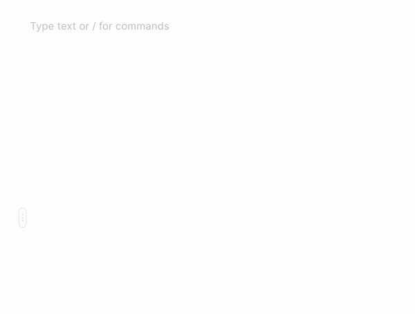
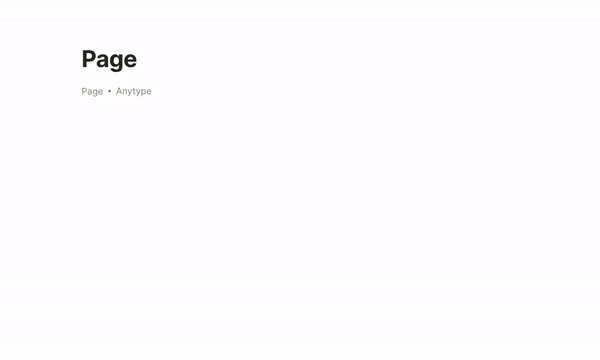
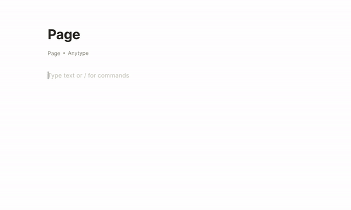

# Blocks & Canvas

### Object canvas

Every object has a flexible canvas made of simple blocks. Each block is a piece of information that you can freely move around the canvas.&#x20;

Every object has a flexible canvas made of simple blocks. Each block is a piece of information that you can freely move around the canvas. You can add any information you like by hitting the `+` button or in-line by typing `/`. Highlight a block to see its size or move it elsewhere on the canvas. To create a column, drag one block to the end of another block.

Add any information you like by hitting the `+` button or in-line by typing `/`. Highlight a block to see its size or move it elsewhere on the canvas. To create a column, drag one block to the end of another block.

### **The following blocks are available in this version of Anytype:**

Open the block menu by hitting  button on the left side of the block to delete, duplicate or add styling to the block.

* Text: text, title, heading, subheading, highlighted
* Lists: checkbox, bulleted list, numbered, toggle
* Media: file, picture, video, bookmark, code-snippet, LaTeX
* [objects.md](objects.md "mention"): create new objects (tasks, people, documents) and link to an existing object
* [relations.md](relations.md "mention"): all relations for this object
* Others: line divider, dotted divider

## Text editing

Adding content is very simple - just tap on an empty area and start typing. You can also drag and drop the input field on both Mac (from the sidebar) and iOS (from the bottom bar) in order to drop content at a specific location.

**The following blocks are available in this version of Anytype**:

* Text: title, heading, subheading, highlighted
* Lists: checkbox, bulleted list, numbered, toggle

## Media

**The following media blocks are available in this version of Anytype**: Images, Audio, Video, Files. Add it on the canvas by hitting the `+` button or in-line by typing `/`. Or you can add it by drag\&drop on the canvas.

## Advanced blocks 

### LaTeX blocks

Add a block with mathematical formulae and equations using [**LaTeX** format](https://www.latex-project.org)

### Code snippets

You can insert some code by using a **code snippet**. Choose your language to highlight syntax automatically based on this language.

.gif>)

## Relations, Mentions & Object Links

There are several options to add another object to Canvas: as Relation, as Object Link, and Mentions.&#x20;

### As Relation

You can add any Relation on the Canvas by hitting the `+` button or in-line by typing `/`. Type the name of a Relation or choose one from the list.

.gif>)

### As Object Link

.gif>)

### As Mention

.gif>)

## Block styling

