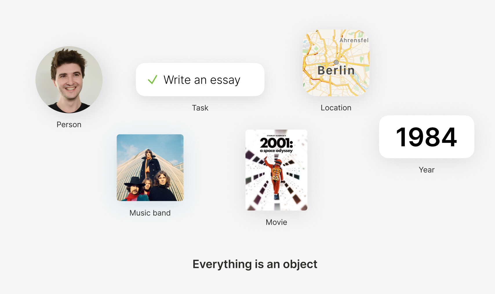

# Object

Everything in Anytype is an object: people, books, musicians, documents, ideas, places, numbers, or files. For instance, a person named "Enda," an essay to write, the music of "Pink Floyd," the film "2001", a town called "Berlin," a year, or just a simple status like "Done."

#### Object canvas

Every object has a flexible canvas made of simple blocks. Each block is a piece of information that you can freely move around the canvas. You can add any information you like by hitting the `+` button or in-line by typing `/`. Highlight a block to see its size or move it elsewhere on the canvas. To create a column, drag one block to the end of another block.

**The following blocks are available in this version of Anytype:**

* Text: text, title, heading, subheading, highlighted
* Lists: checkbox, bulleted list, numbered, toggle
* Media: file, picture, video, bookmark, code-snippet
* Objects: create new objects (tasks, people, documents), or link to an existing object
* Relations: all relations for this object
* Others: line divider, dotted divider

#### **Object layout**

Layouts help you customize how your object looks. You can align your text blocks, customize the icon type, or change the page width.

**Anytype currently supports three kinds of layout:**

1. **Basic:** a classic view for notes, articles, and docs.
2. **Profile:** designed for contacts, people, and organizations.
3. **Action:** for getting things done. Perfect for tasks and plans.

We designed layouts to be extendable. In the future, anyone can make new layouts.


Primary and profile layouts support either an emoji or a photo icon. All layouts support a cover image.

