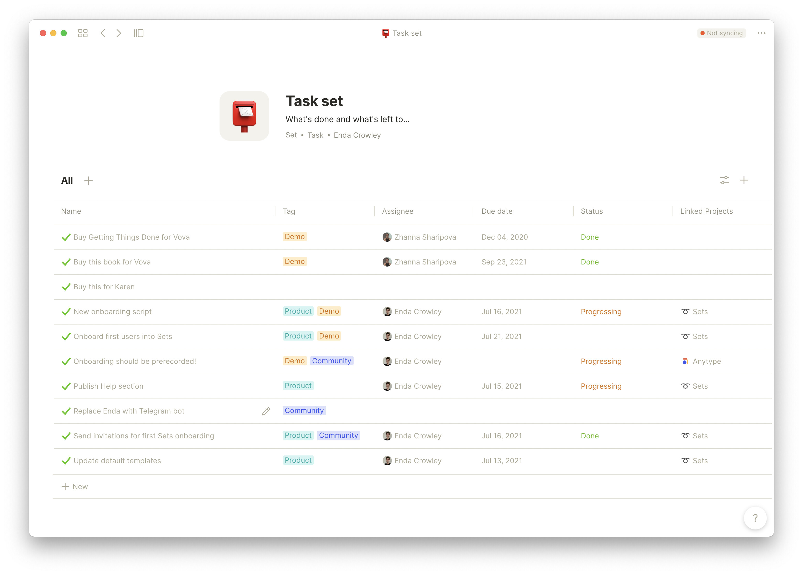

# Sets

Bring multiple objects into one view with Sets. You can make a Set for a specific type of object, like seeing every task in one view. Inside a Set, you can sort, filter, and choose a view.

Sets don't **store** objects. They are a way to see a portion of your knowledge graph like objects tagged `Work`. Sets help you sort through and create specific views to work with many objects at once

#### **Creating Sets**

You can create any type with + menu in Home or in bottom-left corner. After that

* You can set type you want to see. For project management you may want to see: Idea, Feature, Project types and the same time
* Or you can choose any type and decide on what relation you want to see. You may use tag ==`memory` throughout the whole anytype and you will see all of them in one place

.gif>)

From the Store, choose an object type, click "Create," and choose "Create a set."

