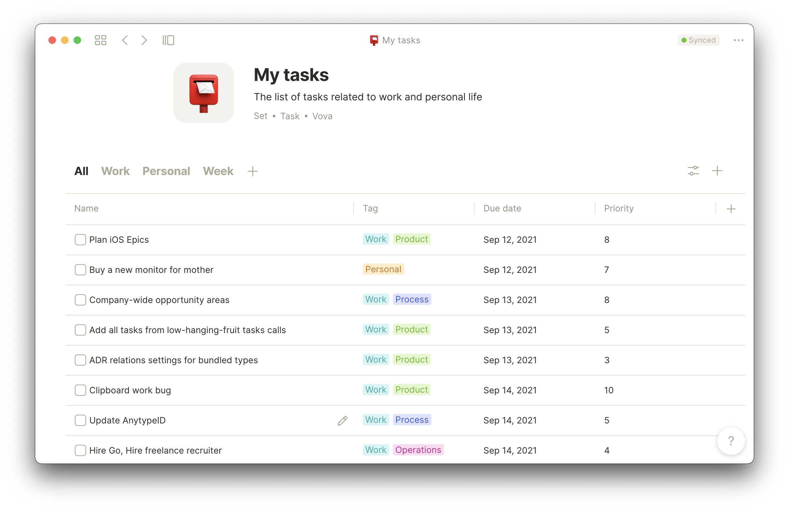
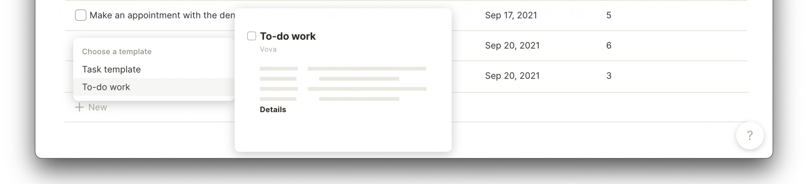

# Creating a Task List

### Steps

1. You need to open **Store** in **Home** screen, which contains all **Types** in Anytype
2. Scroll down and click on a **Task**.
3. Have a look at **the Relations** and **Template** we propose. You can add more relations later, create another template, but you can't delete existing ones or change an icon. If you need your fully custom type, you need to go back to Store and press "Create a new type." In your custom **Type**, you can choose from the list of **Relations**.
4. To create a **Task tracker**, you need to click "Create" → "New Set of objects."
5. So now you can view all Tasks in one place. For the Task list, you may add relations. `Tag` , `Due date` , `Priority` Or any other being useful for your tracker.
6. You can also use filters, sorts, and views like:
   1. Relation `Done` `Is` `Unchecked` so you will see only those that are not done
   2. Create a view Works and Personal with filters `Tag` `contains` `Work` and `Tag` `contains` `Personal` to separate the lists
   3. Make `Due date` `ascending` to see nearest tasks higher

You can create any object **Task** with the `+` button in-row in your Set, in the editor by typing `/Task` , or using `+` from the dashboard. **All of these objects will be shown in this Set.**

### Template

It's very handy to create templates for repeatable tasks with pre-filled options. Like Template related to Work can contain `Tag` `==` `Work` with higher default priority

